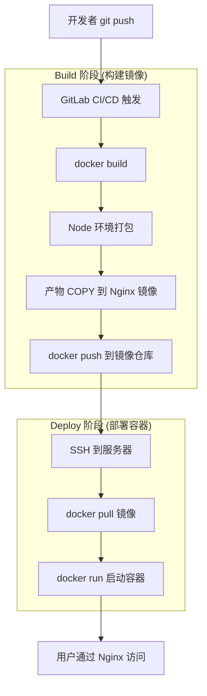
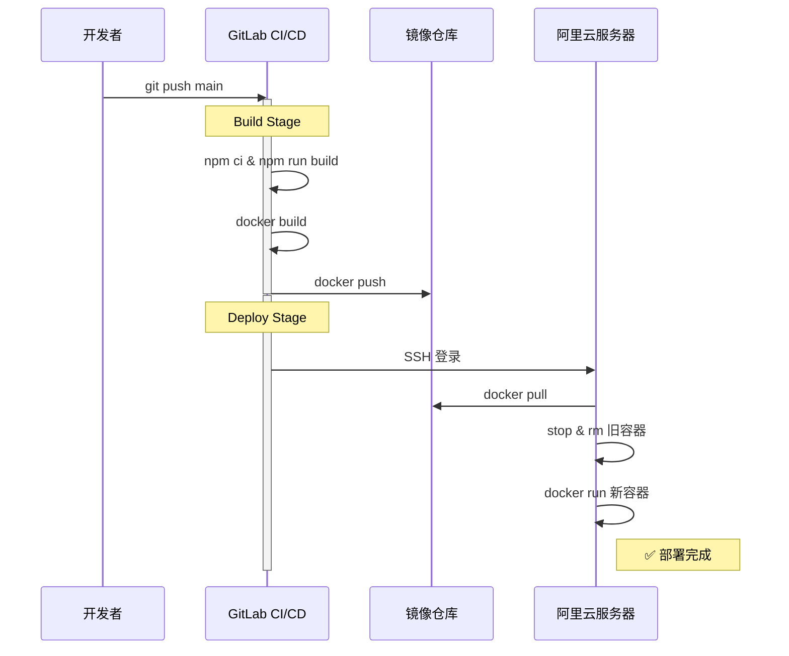

# Vue3 项目 CI/CD 部署方案（无 CDN，纯 Docker）

> 适用于内部系统、后台管理等不需要 CDN 加速的场景。

## 架构总览



---

## 需要创建的文件

```
my-vue-app/
├── src/                  # 源码
├── package.json
├── vite.config.ts
├── .dockerignore         ← 新建
├── nginx.conf            ← 新建（容器内 Nginx）
├── Dockerfile            ← 新建
└── .gitlab-ci.yml        ← 新建
```

---

## 1. `.dockerignore`

```
node_modules
dist
.git
.gitignore
*.md
.vscode
.env*.local
```

> 作用：排除无关文件，减小 Docker 构建上下文体积，加速构建。

---

## 2. `nginx.conf`（容器内 Nginx 配置）

⚠️ 这不是宿主机的 Nginx，是 Docker 容器内部的。

```nginx
server {
    listen 80;
    server_name localhost;

    root /usr/share/nginx/html;
    index index.html;

    # ---- SPA 路由支持 ----
    # Vue Router 使用 history 模式时，直接访问子路由会 404
    # try_files 让所有匹配不到文件的请求回退到 index.html
    location / {
        try_files $uri $uri/ /index.html;
    }

    # ---- 静态资源长期缓存 ----
    # Vite 打包的文件名带 hash（如 app-a1b2c3.js）
    # 内容变了 → 文件名变 → 自动刷新缓存，所以放心设 1 年
    location /assets/ {
        expires 1y;
        add_header Cache-Control "public, immutable";
        gzip on;
        gzip_types text/css application/javascript application/json image/svg+xml;
    }

    # ---- 安全头 ----
    add_header X-Frame-Options "SAMEORIGIN" always;
    add_header X-Content-Type-Options "nosniff" always;

    # ---- 禁止访问隐藏文件（如 .env）----
    location ~ /\. {
        deny all;
    }
}
```

---

## 3. `Dockerfile`（多阶段构建）

```dockerfile
# =============================================
# 阶段 1：构建（Node 环境打包）
# =============================================
FROM node:20-alpine AS builder
WORKDIR /app

# 先复制 package 文件 → 利用 Docker 缓存层
# 只有 package.json 变了才会重新 npm ci
COPY package.json package-lock.json ./
RUN npm ci

# 复制源码并打包
COPY . .
RUN npm run build
# 产物在 /app/dist/

# =============================================
# 阶段 2：运行（Nginx 托管静态文件）
# =============================================
FROM nginx:1.25-alpine AS runner

# 清空默认页面
RUN rm -rf /usr/share/nginx/html/*

# 从 builder 阶段拿打包产物
COPY --from=builder /app/dist /usr/share/nginx/html

# 用自定义 Nginx 配置覆盖默认配置
COPY nginx.conf /etc/nginx/conf.d/default.conf

EXPOSE 80
CMD ["nginx", "-g", "daemon off;"]
```

### 为什么用两阶段构建？

| | 单阶段 | 两阶段构建 |
|--|-------|----------|
| 最终镜像 | Node + npm + node_modules + 源码 + dist | 只有 Nginx + dist |
| 大小 | ~1 GB | ~30 MB |
| 安全 | 暴露源码和依赖 | 只有生产文件 |

---

## 4. `.gitlab-ci.yml`

```yaml
# ====== 全局变量 ======
variables:
  IMAGE_NAME: $CI_REGISTRY_IMAGE       # GitLab 自动注入，镜像仓库地址
  DEPLOY_SERVER: "47.xxx.xxx.xxx"      # 替换为你的服务器 IP

# ====== 阶段 ======
stages:
  - build
  - deploy

# ====== 阶段 1：构建 Docker 镜像 ======
build:
  stage: build
  image: docker:24                     # Runner 用 Docker 镜像
  services:
    - docker:24-dind                   # Docker in Docker，让 CI 能跑 docker 命令
  before_script:
    # 登录 GitLab 自带的镜像仓库
    - docker login -u $CI_REGISTRY_USER -p $CI_REGISTRY_PASSWORD $CI_REGISTRY
  script:
    # 构建镜像（打两个 tag：commit hash + latest）
    - docker build -t $IMAGE_NAME:$CI_COMMIT_SHORT_SHA -t $IMAGE_NAME:latest .
    # 推送到仓库
    - docker push $IMAGE_NAME:$CI_COMMIT_SHORT_SHA
    - docker push $IMAGE_NAME:latest
    - echo "✅ 镜像构建完成"
  only:
    - main                             # 只有 main 分支触发

# ====== 阶段 2：部署到服务器 ======
deploy:
  stage: deploy
  image: alpine:latest
  before_script:
    # 安装 SSH 并配置密钥
    - apk add --no-cache openssh-client
    - mkdir -p ~/.ssh
    - echo "$SSH_PRIVATE_KEY" > ~/.ssh/id_rsa
    - chmod 600 ~/.ssh/id_rsa
    - ssh-keyscan -H $DEPLOY_SERVER >> ~/.ssh/known_hosts
  script:
    # SSH 到服务器执行部署
    - |
      ssh root@$DEPLOY_SERVER << 'EOF'
        echo "====== 开始部署 ======"

        # 1. 登录镜像仓库
        docker login -u gitlab-ci-token -p $CI_REGISTRY_PASSWORD $CI_REGISTRY

        # 2. 拉取最新镜像
        docker pull $IMAGE_NAME:latest

        # 3. 停止旧容器（|| true 防止不存在时报错）
        docker stop vue-app || true
        docker rm vue-app || true

        # 4. 启动新容器
        docker run -d \
          --name vue-app \
          -p 8080:80 \
          --restart always \
          $IMAGE_NAME:latest

        # 5. 清理旧的悬挂镜像
        docker image prune -f

        echo "✅ 部署完成"
      EOF
  only:
    - main
```

---

## 5. GitLab CI/CD Variables 配置

在 GitLab → Settings → CI/CD → Variables 中添加：

| Variable | 值 | 属性 |
|----------|---|------|
| `SSH_PRIVATE_KEY` | 服务器 SSH 私钥内容 | Protected + Masked |

> `CI_REGISTRY`、`CI_REGISTRY_USER`、`CI_REGISTRY_PASSWORD` 是 GitLab **自动注入**的，无需手动设置。

---

## 6. 宿主机 Nginx 反向代理

文件：`/etc/nginx/conf.d/vue-app.conf`

```nginx
server {
    listen 80;
    server_name your-domain.cn;

    location / {
        proxy_pass http://127.0.0.1:8080;   # 转发到 Docker 容器
        proxy_set_header Host $host;
        proxy_set_header X-Real-IP $remote_addr;
        proxy_set_header X-Forwarded-For $proxy_add_x_forwarded_for;
        proxy_set_header X-Forwarded-Proto $scheme;
    }
}
```

```bash
# 验证 & 重载
nginx -t && nginx -s reload
```

---

## 7. 本地测试

```bash
# 构建
docker build -t my-vue-app:test .

# 运行
docker run -d -p 8080:80 --name vue-test my-vue-app:test

# 浏览器打开 http://localhost:8080

# 清理
docker stop vue-test && docker rm vue-test
```

---

## 完整执行时序



---

## 完整请求链路

```
用户浏览器请求 https://your-domain.cn/about
      ↓
宿主机 Nginx(:80)
      ↓ proxy_pass
Docker 容器 Nginx(:8080 → 容器内 :80)
      ↓ try_files
      ├── /about 文件不存在
      └── 返回 /index.html
      ↓
Vue Router 接管 → 渲染 /about 页面
      ↓
浏览器请求 /assets/js/app-xxx.js（同样走这条链路）
```

---

## CI 和 Dockerfile 的关系

```
CI 文件（.gitlab-ci.yml）先执行
      ↓
CI 的 script 中执行 docker build
      ↓
docker build 才读取 Dockerfile
```

| | `.gitlab-ci.yml` | `Dockerfile` |
|--|-----------------|-------------|
| 角色 | 总调度（流水线编排） | 镜像构建说明书 |
| 触发 | git push 自动触发 | CI 中 `docker build` 触发 |
| 运行位置 | GitLab Runner | Docker 引擎 |
| 类比 | 工厂生产排程表 | 产品的生产图纸 |

> **一句话：CI 是流水线，Dockerfile 是流水线上某一道工序的操作手册。**
