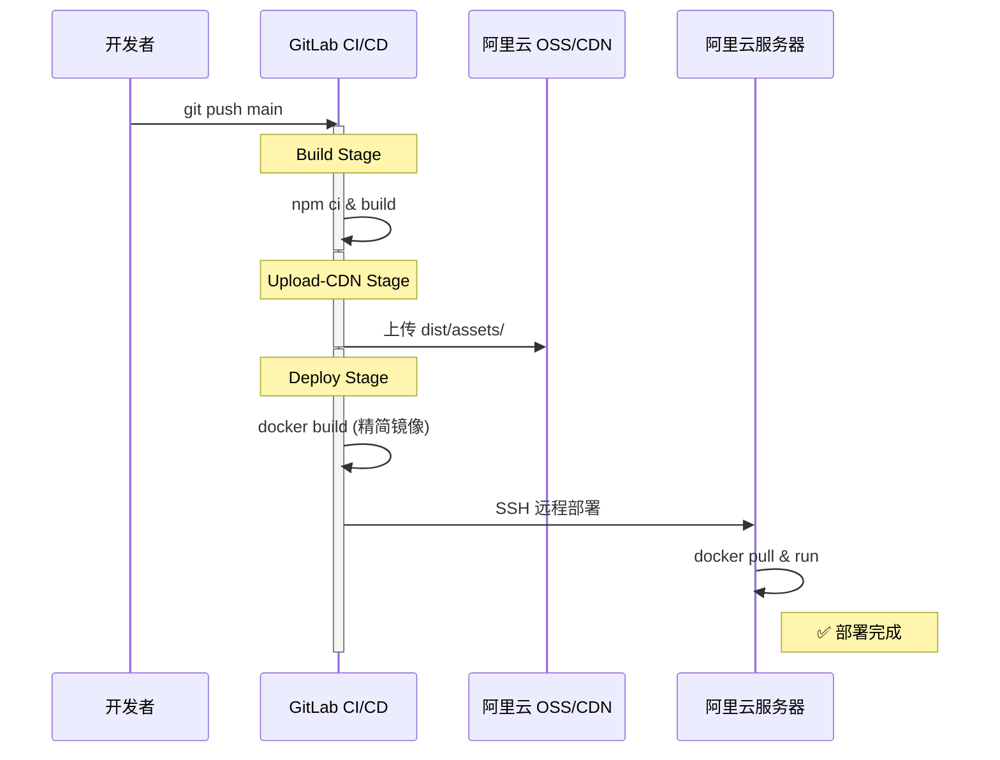

# Vue3 项目 CI/CD 部署方案（有 CDN，Docker + OSS）

> 适用于面向公众的正式项目，静态资源通过 CDN 全国加速。

## 架构总览

```mermaid
graph TD
    Start[开发者 git push] --> CI[GitLab CI/CD 触发]
    
    subgraph "Build 阶段 (打包)"
        CI --> Build[npm ci & build]
        Build --> Dist[生成 dist/ 产物]
    end
    
    subgraph "Upload-CDN 阶段 (上传)"
        Dist --> OSS[ossutil 上传 dist/assets/ 到 OSS]
        OSS --> CDN[CDN 自动从 OSS 拉取并加速]
    end
    
    subgraph "Deploy 阶段 (部署容器)"
        Dist --> Docker[docker build (仅包含 index.html)]
        Docker --> Push[docker push 到镜像仓库]
        Push --> SSH[SSH 部署到服务器]
        SSH --> Run[docker run 启动新容器]
    end
    
    Run --> User[用户访问网站]
```

### 与无 CDN 方案的核心区别

| | 无 CDN | 有 CDN |
|--|-------|--------|
| 静态资源位置 | 全在 Docker 容器内 | OSS + CDN |
| Docker 镜像内容 | index.html + assets | 只有 index.html |
| 镜像大小 | ~30MB | 更小 |
| 访问速度 | 取决于服务器带宽 | 全国 CDN 加速 |

---

## 前置准备

### 1. 创建阿里云 OSS Bucket

- 阿里云控制台 → 对象存储 OSS → 创建 Bucket
- 名称：如 `my-vue-cdn`
- 地域：和服务器同地域（如华东 1）
- 权限：**公共读**

### 2. 创建 RAM 子账号（给 CI/CD 用）

> ⚠️ 不要用主账号 AccessKey，安全风险大！

- RAM 访问控制 → 创建用户 → 勾选 **OpenAPI 调用访问**
- 分配权限：`AliyunOSSFullAccess`
- 保存 **AccessKey ID** 和 **AccessKey Secret**

### 3. 配置 CDN 回源 OSS

- 阿里云 CDN → 添加域名
  - 加速域名：`cdn.your-domain.cn`
  - 源站类型：**OSS 域名** → 选择 Bucket
- 去 DNS 控制台配置 CNAME 解析

### 4. 配置 HTTPS（可选但推荐）

- CDN 控制台 → 域名管理 → HTTPS 配置 → 上传 SSL 证书

---

## 需要创建/修改的文件

```
my-vue-app/
├── src/
├── package.json
├── vite.config.ts        ← 修改：设置 base 为 CDN 地址
├── .dockerignore         ← 新建
├── nginx.conf            ← 新建（容器内 Nginx）
├── Dockerfile            ← 新建
└── .gitlab-ci.yml        ← 新建
```

---

## 1. `vite.config.ts`（关键修改）

```ts
import { defineConfig } from 'vite'
import vue from '@vitejs/plugin-vue'

export default defineConfig(({ mode }) => ({
  // ★ 核心：生产环境的静态资源指向 CDN 地址
  base: mode === 'production'
    ? 'https://cdn.your-domain.cn/'
    : '/',

  build: {
    assetsDir: 'assets',
    assetsInlineLimit: 4096,    // 小于 4KB 的资源内联为 base64
    rollupOptions: {
      output: {
        // 分包策略
        manualChunks(id) {
          if (id.includes('node_modules')) {
            if (id.includes('element-plus')) return 'element-plus'
            if (id.includes('vue')) return 'vue-vendor'
            return 'vendor'
          }
        },
        // 文件命名（带 hash 便于缓存）
        chunkFileNames: 'assets/js/[name]-[hash].js',
        entryFileNames: 'assets/js/[name]-[hash].js',
        assetFileNames: 'assets/[ext]/[name]-[hash].[ext]',
      },
    },
  },
}))
```

设置 `base` 后，打包产物 `index.html` 中的引用会自动变成：

```html
<!-- 改之前 -->
<script src="/assets/js/app-a1b2c3.js"></script>

<!-- 改之后 -->
<script src="https://cdn.your-domain.cn/assets/js/app-a1b2c3.js"></script>
```

---

## 2. `.dockerignore`

```
node_modules
dist
.git
.gitignore
*.md
.vscode
.env*.local
```

---

## 3. `nginx.conf`（容器内）

```nginx
server {
    listen 80;
    server_name localhost;

    root /usr/share/nginx/html;
    index index.html;

    # SPA 路由支持
    location / {
        try_files $uri $uri/ /index.html;
    }

    # 安全头
    add_header X-Frame-Options "SAMEORIGIN" always;
    add_header X-Content-Type-Options "nosniff" always;

    location ~ /\. {
        deny all;
    }
}
```

> 注意：这个方案中 assets 走 CDN，所以容器内不需要 assets 缓存配置。

---

## 4. `Dockerfile`

```dockerfile
# 阶段 1：构建
FROM node:20-alpine AS builder
WORKDIR /app
COPY package.json package-lock.json ./
RUN npm ci
COPY . .
RUN npm run build

# 阶段 2：运行
FROM nginx:1.25-alpine AS runner
RUN rm -rf /usr/share/nginx/html/*
COPY --from=builder /app/dist /usr/share/nginx/html
COPY nginx.conf /etc/nginx/conf.d/default.conf
EXPOSE 80
CMD ["nginx", "-g", "daemon off;"]
```

---

## 5. `.gitlab-ci.yml`（核心，三个阶段）

```yaml
# ====== 全局变量 ======
variables:
  IMAGE_NAME: $CI_REGISTRY_IMAGE
  OSS_BUCKET: "my-vue-cdn"
  OSS_ENDPOINT: "oss-cn-hangzhou.aliyuncs.com"
  DEPLOY_SERVER: "47.xxx.xxx.xxx"

# ====== 三个阶段 ======
stages:
  - build         # 打包
  - upload-cdn    # 上传静态资源到 OSS
  - deploy        # Docker 构建 + 部署

# ====== 阶段 1：打包构建 ======
build:
  stage: build
  image: node:20-alpine
  script:
    - npm ci
    - npm run build
  artifacts:
    paths:
      - dist/             # 传递给后续阶段
    expire_in: 1 hour
  only:
    - main

# ====== 阶段 2：上传静态资源到 OSS ======
upload-cdn:
  stage: upload-cdn
  image: alpine:latest
  dependencies:
    - build               # 拿到 build 阶段的 dist/
  before_script:
    # 安装 ossutil（阿里云 OSS 命令行工具）
    - apk add --no-cache curl
    - curl -o ossutil https://gosspublic.alicdn.com/ossutil/v2/2.0.3-beta.09041200/ossutil-2.0.3-beta.09041200-linux-amd64
    - chmod +x ossutil && mv ossutil /usr/local/bin/
    # 配置 ossutil 认证
    - |
      cat > ~/.ossutilconfig << EOF
      [default]
      accessKeyId=${ACCESS_KEY_ID}
      accessKeySecret=${ACCESS_KEY_SECRET}
      endpoint=${OSS_ENDPOINT}
      EOF
  script:
    # 上传 assets 到 OSS
    # --update：只上传有变化的文件
    # --meta：设置 HTTP 缓存头（hash 文件缓存 1 年）
    - |
      ossutil cp -r dist/assets/ oss://${OSS_BUCKET}/assets/ \
        --update \
        --meta "Cache-Control:public,max-age=31536000"
    - echo "✅ 静态资源已上传到 OSS"
  only:
    - main

# ====== 阶段 3：Docker 构建 + 部署 ======
deploy:
  stage: deploy
  image: docker:24
  services:
    - docker:24-dind
  dependencies:
    - build               # 拿到 dist/
  before_script:
    # 登录镜像仓库
    - docker login -u $CI_REGISTRY_USER -p $CI_REGISTRY_PASSWORD $CI_REGISTRY
  script:
    # ① 删除 assets（已经上传到 OSS 了，不需要打进镜像）
    - rm -rf dist/assets/

    # ② 构建精简版 Docker 镜像（只有 index.html + favicon 等）
    - docker build -t $IMAGE_NAME:$CI_COMMIT_SHORT_SHA -t $IMAGE_NAME:latest .
    - docker push $IMAGE_NAME:latest
    - echo "✅ 镜像构建完成"

    # ③ SSH 到服务器部署
    - apk add --no-cache openssh-client
    - mkdir -p ~/.ssh
    - echo "$SSH_PRIVATE_KEY" > ~/.ssh/id_rsa
    - chmod 600 ~/.ssh/id_rsa
    - ssh-keyscan -H $DEPLOY_SERVER >> ~/.ssh/known_hosts

    - |
      ssh root@$DEPLOY_SERVER << 'EOF'
        echo "====== 开始部署 ======"
        docker login -u gitlab-ci-token -p $CI_REGISTRY_PASSWORD $CI_REGISTRY
        docker pull $IMAGE_NAME:latest
        docker stop vue-app || true
        docker rm vue-app || true
        docker run -d \
          --name vue-app \
          -p 8080:80 \
          --restart always \
          $IMAGE_NAME:latest
        docker image prune -f
        echo "✅ 部署完成"
      EOF
  only:
    - main
```

---

## 6. GitLab CI/CD Variables 配置

GitLab → Settings → CI/CD → Variables：

| Variable | 值 | 属性 |
|----------|---|------|
| `ACCESS_KEY_ID` | 阿里云 RAM 子账号 AK | Protected + Masked |
| `ACCESS_KEY_SECRET` | 阿里云 RAM 子账号 SK | Protected + Masked |
| `SSH_PRIVATE_KEY` | 服务器 SSH 私钥 | Protected + Masked |

> `CI_REGISTRY` 等 GitLab 自动注入，无需手动设置。

---

## 7. 宿主机 Nginx 反代

`/etc/nginx/conf.d/vue-app.conf`：

```nginx
server {
    listen 80;
    server_name your-domain.cn;

    location / {
        proxy_pass http://127.0.0.1:8080;
        proxy_set_header Host $host;
        proxy_set_header X-Real-IP $remote_addr;
        proxy_set_header X-Forwarded-For $proxy_add_x_forwarded_for;
        proxy_set_header X-Forwarded-Proto $scheme;
    }
}
```

---

## 完整执行时序



---

## 用户访问请求流程

```
用户浏览器请求 https://your-domain.cn
      ↓
① 宿主机 Nginx → Docker Nginx → 返回 index.html
      ↓
② 浏览器解析 index.html，发现引用了 CDN 资源：
   <script src="https://cdn.your-domain.cn/assets/js/app-a1b2c3.js">
   <link href="https://cdn.your-domain.cn/assets/css/style-d4e5f6.css">
      ↓
③ 浏览器直接请求 CDN
      ↓
④ CDN 边缘节点（离用户最近的节点）：
   ├── 有缓存 → 直接返回（极快，<10ms）
   └── 无缓存 → 回源 OSS → 缓存后返回
```

---

## 为什么 index.html 不走 CDN？

| | index.html | assets/（JS/CSS/图片） |
|--|-----------|---------------------|
| 变更频率 | 每次部署都变 | 内容变了文件名也变（hash） |
| 缓存策略 | 不缓存 / 短缓存 | 永久缓存（1 年） |
| 放哪里 | Docker 容器（Nginx） | OSS + CDN |

如果 index.html 也走 CDN 缓存：
1. 用户访问 → CDN 返回旧的 index.html
2. 旧的 index.html 引用旧的 JS 文件
3. 新部署的 JS 文件名已经变了 → 404 白屏

---

## 可选优化：第三方依赖也走 CDN

在上述方案基础上，还可以把 Vue、Element Plus 等从公共 CDN 加载：

```bash
npm install vite-plugin-cdn-import -D
```

```ts
// vite.config.ts
import { autoComplete, Plugin as importToCDN } from 'vite-plugin-cdn-import'

export default defineConfig(({ mode }) => ({
  base: mode === 'production' ? 'https://cdn.your-domain.cn/' : '/',
  plugins: [
    vue(),
    importToCDN({
      prodUrl: 'https://cdn.bootcdn.net/ajax/libs/{name}/{version}/{path}',
      modules: [
        autoComplete('vue'),
        autoComplete('axios'),
      ],
    }),
  ],
  // ...build 配置同上
}))
```

效果：打包体积减少约 1MB+

---

## 安全防护（CDN 必做）

| 措施 | 位置 | 重要程度 |
|------|------|---------|
| 设带宽/流量封顶 | CDN → 用量封顶 | ⭐⭐⭐⭐⭐ 必做 |
| 设账单预警 | 费用中心 → 报警 | ⭐⭐⭐⭐⭐ 必做 |
| IP 频次限制 | CDN → 安全配置 | ⭐⭐⭐⭐ 推荐 |
| Referer 防盗链 | CDN → 白名单 | ⭐⭐⭐ 建议 |

---

## 常见问题

**Q: OSS 上旧文件堆积怎么办？**

在 CI 中部署前清理：
```yaml
- ossutil rm -r oss://${OSS_BUCKET}/assets/ --force
```

**Q: 费用大概多少？**

个人项目：每月 ¥1 以内（流量小）。但务必设封顶防刷量攻击。

**Q: 公共 CDN（jsdelivr）vs 自有 OSS CDN？**

| | 公共 CDN | 自有 OSS + CDN |
|--|---------|---------------|
| 内容 | 只能放 npm 包 | 你的任何文件 |
| 控制 | 无 | 完全可控 |
| 国内稳定性 | jsdelivr 偶尔被墙 | 阿里云稳定 |
