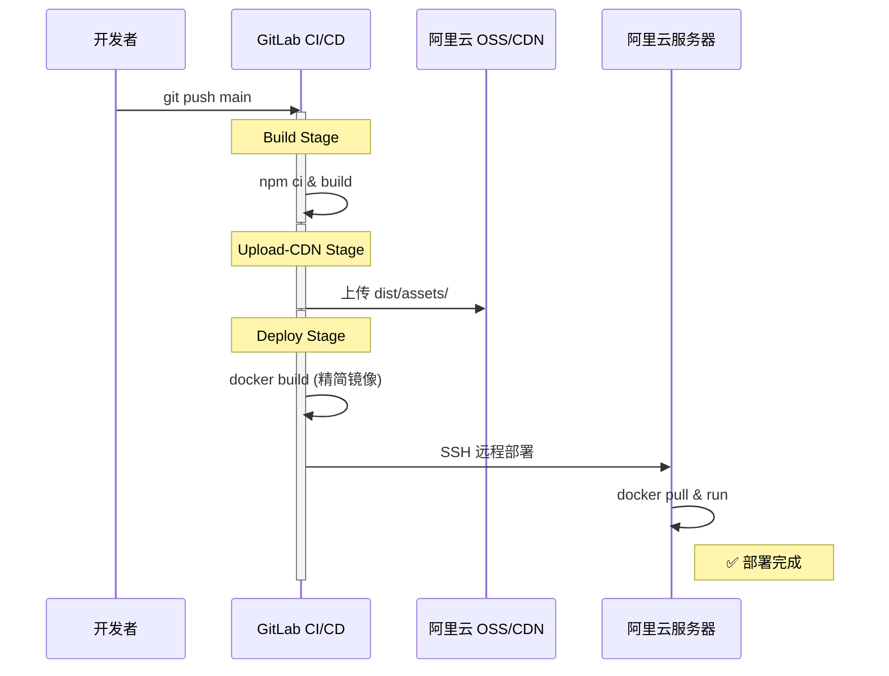

上一篇介绍了纯 Docker 部署方案，所有文件都放在容器内。本篇在此基础上引入 **阿里云 OSS + CDN**，让静态资源（JS/CSS/图片）走 CDN 全国加速，适合面向公众的正式项目。

## 与无 CDN 方案的区别

| 比较项目 | 方案一：纯 Docker | 方案二：Docker + CDN |
|---|---|---|
| 静态资源位置 | 全在容器内 | 托管在 OSS/CDN |
| 镜像内容 | 包含所有静态资源 | 仅包含 index.html |
| 访问速度 | 受限于服务器带宽 | 全国 CDN 节点加速 |
| 推荐指数 | 三颗星 | 五颗星 |

## 架构总览

```mermaid
graph TD
    Start[开发者 git push] --> CI[GitLab CI/CD 触发]
    
    subgraph "Build 阶段 (打包)"
        CI --> Build[npm ci & build]
        Build --> Dist[生成 dist/ 产物]
    end
    
    subgraph "Upload-CDN 阶段 (上传)"
        Dist --> OSS[ossutil 上传 dist/assets/ 到 OSS]
        OSS --> CDN[CDN 自动从 OSS 拉取并加速]
    end
    
    subgraph "Deploy 阶段 (部署容器)"
        Dist --> Docker[docker build (仅包含 index.html)]
        Docker --> Push[docker push 到镜像仓库]
        Push --> SSH[SSH 部署到服务器]
        SSH --> Run[docker run 启动新容器]
    end
    
    Run --> User[用户访问网站]
```

---

## 前置准备

### 1. 创建阿里云 OSS Bucket

- 阿里云控制台 → 对象存储 OSS → 创建 Bucket
- 名称：如 `my-vue-cdn`
- 地域：和服务器同地域
- 权限：**公共读**

### 2. 创建 RAM 子账号

⚠️ 不要用主账号 AccessKey！

- RAM 访问控制 → 创建用户 → 勾选 **OpenAPI 调用访问**
- 分配权限：`AliyunOSSFullAccess`
- 保存 AccessKey ID 和 Secret

### 3. 配置 CDN 回源 OSS

- CDN → 添加域名 → 加速域名填 `cdn.your-domain.cn`
- 源站类型：**OSS 域名** → 选择你的 Bucket
- 去 DNS 控制台配置 CNAME 解析

---

## 配置文件

### 1. `vite.config.ts`（关键修改）

```ts
import { defineConfig } from 'vite'
import vue from '@vitejs/plugin-vue'

export default defineConfig(({ mode }) => ({
  // ★ 生产环境静态资源指向 CDN
  base: mode === 'production'
    ? 'https://cdn.your-domain.cn/'
    : '/',

  build: {
    assetsDir: 'assets',
    assetsInlineLimit: 4096,
    rollupOptions: {
      output: {
        manualChunks(id) {
          if (id.includes('node_modules')) {
            if (id.includes('element-plus')) return 'element-plus'
            if (id.includes('vue')) return 'vue-vendor'
            return 'vendor'
          }
        },
        chunkFileNames: 'assets/js/[name]-[hash].js',
        entryFileNames: 'assets/js/[name]-[hash].js',
        assetFileNames: 'assets/[ext]/[name]-[hash].[ext]',
      },
    },
  },
}))
```

设置 `base` 后，打包的 index.html 中引用自动变为：

```html
<!-- 改前 -->
<script src="/assets/js/app-a1b2c3.js"></script>
<!-- 改后 -->
<script src="https://cdn.your-domain.cn/assets/js/app-a1b2c3.js"></script>
```

### 2. `.dockerignore`

```
node_modules
dist
.git
.gitignore
*.md
.vscode
.env*.local
```

### 3. `nginx.conf`（容器内）

```nginx
server {
    listen 80;
    server_name localhost;

    root /usr/share/nginx/html;
    index index.html;

    location / {
        try_files $uri $uri/ /index.html;
    }

    add_header X-Frame-Options "SAMEORIGIN" always;
    add_header X-Content-Type-Options "nosniff" always;

    location ~ /\. {
        deny all;
    }
}
```

> 注意：assets 走 CDN，容器内不需要 assets 缓存配置。

### 4. `Dockerfile`

```dockerfile
FROM node:20-alpine AS builder
WORKDIR /app
COPY package.json package-lock.json ./
RUN npm ci
COPY . .
RUN npm run build

FROM nginx:1.25-alpine AS runner
RUN rm -rf /usr/share/nginx/html/*
COPY --from=builder /app/dist /usr/share/nginx/html
COPY nginx.conf /etc/nginx/conf.d/default.conf
EXPOSE 80
CMD ["nginx", "-g", "daemon off;"]
```

---

## `.gitlab-ci.yml`（核心，三阶段）

```yaml
variables:
  IMAGE_NAME: $CI_REGISTRY_IMAGE
  OSS_BUCKET: "my-vue-cdn"
  OSS_ENDPOINT: "oss-cn-hangzhou.aliyuncs.com"
  DEPLOY_SERVER: "47.xxx.xxx.xxx"

stages:
  - build
  - upload-cdn
  - deploy

# ===== 阶段 1：打包 =====
build:
  stage: build
  image: node:20-alpine
  script:
    - npm ci
    - npm run build
  artifacts:
    paths:
      - dist/
    expire_in: 1 hour
  only:
    - main

# ===== 阶段 2：上传静态资源到 OSS =====
upload-cdn:
  stage: upload-cdn
  image: alpine:latest
  dependencies:
    - build
  before_script:
    - apk add --no-cache curl
    - curl -o ossutil https://gosspublic.alicdn.com/ossutil/v2/2.0.3-beta.09041200/ossutil-2.0.3-beta.09041200-linux-amd64
    - chmod +x ossutil && mv ossutil /usr/local/bin/
    - |
      cat > ~/.ossutilconfig << EOF
      [default]
      accessKeyId=${ACCESS_KEY_ID}
      accessKeySecret=${ACCESS_KEY_SECRET}
      endpoint=${OSS_ENDPOINT}
      EOF
  script:
    - |
      ossutil cp -r dist/assets/ oss://${OSS_BUCKET}/assets/ \
        --update \
        --meta "Cache-Control:public,max-age=31536000"
    - echo "✅ 静态资源已上传到 OSS"
  only:
    - main

# ===== 阶段 3：Docker 构建 + 部署 =====
deploy:
  stage: deploy
  image: docker:24
  services:
    - docker:24-dind
  dependencies:
    - build
  before_script:
    - docker login -u $CI_REGISTRY_USER -p $CI_REGISTRY_PASSWORD $CI_REGISTRY
  script:
    # 删除 assets（已上传到 OSS）
    - rm -rf dist/assets/
    # 构建精简镜像
    - docker build -t $IMAGE_NAME:$CI_COMMIT_SHORT_SHA -t $IMAGE_NAME:latest .
    - docker push $IMAGE_NAME:latest
    # SSH 部署
    - apk add --no-cache openssh-client
    - mkdir -p ~/.ssh
    - echo "$SSH_PRIVATE_KEY" > ~/.ssh/id_rsa
    - chmod 600 ~/.ssh/id_rsa
    - ssh-keyscan -H $DEPLOY_SERVER >> ~/.ssh/known_hosts
    - |
      ssh root@$DEPLOY_SERVER << 'EOF'
        docker login -u gitlab-ci-token -p $CI_REGISTRY_PASSWORD $CI_REGISTRY
        docker pull $IMAGE_NAME:latest
        docker stop vue-app || true
        docker rm vue-app || true
        docker run -d \
          --name vue-app \
          -p 8080:80 \
          --restart always \
          $IMAGE_NAME:latest
        docker image prune -f
        echo "✅ 部署完成"
      EOF
  only:
    - main
```

---

## GitLab CI/CD Variables

| Variable | 值 | 属性 |
|----------|---|------|
| `ACCESS_KEY_ID` | RAM 子账号 AK | Protected + Masked |
| `ACCESS_KEY_SECRET` | RAM 子账号 SK | Protected + Masked |
| `SSH_PRIVATE_KEY` | 服务器 SSH 私钥 | Protected + Masked |

---

## 宿主机 Nginx 反代

```nginx
server {
    listen 80;
    server_name your-domain.cn;

    location / {
        proxy_pass http://127.0.0.1:8080;
        proxy_set_header Host $host;
        proxy_set_header X-Real-IP $remote_addr;
        proxy_set_header X-Forwarded-For $proxy_add_x_forwarded_for;
        proxy_set_header X-Forwarded-Proto $scheme;
    }
}
```

---

## 完整执行时序



---

## 用户访问流程

```
浏览器请求 https://your-domain.cn
      ↓
① Nginx → Docker → 返回 index.html
      ↓
② 浏览器解析 index.html，发现：
   <script src="https://cdn.your-domain.cn/assets/js/app-a1b2c3.js">
      ↓
③ 浏览器请求 CDN
      ↓
④ CDN 边缘节点：
   ├── 有缓存 → 直接返回（<10ms）
   └── 无缓存 → 回源 OSS → 缓存后返回
```

---

## 为什么 index.html 不走 CDN？

| | index.html | assets/ |
|--|-----------|--------|
| 变更频率 | 每次部署都变 | 内容变了文件名也变（hash） |
| 缓存策略 | 不缓存 | 永久缓存（1 年） |
| 位置 | Docker Nginx | OSS + CDN |

如果 index.html 也走 CDN：CDN 缓存旧 HTML → 引用旧 JS → 新 JS 文件名已变 → 404 白屏。

---

## 可选优化：第三方依赖也走公共 CDN

```bash
npm install vite-plugin-cdn-import -D
```

```ts
import { autoComplete, Plugin as importToCDN } from 'vite-plugin-cdn-import'

export default defineConfig(({ mode }) => ({
  base: mode === 'production' ? 'https://cdn.your-domain.cn/' : '/',
  plugins: [
    vue(),
    importToCDN({
      prodUrl: 'https://cdn.bootcdn.net/ajax/libs/{name}/{version}/{path}',
      modules: [
        autoComplete('vue'),
        autoComplete('axios'),
      ],
    }),
  ],
}))
```

效果：Vue、Axios 等从公共 CDN 加载，打包体积再减 1MB+。

---

## ⚠️ CDN 安全防护（必做）

按量付费 CDN 存在**刷量攻击**风险（恶意制造大量流量产生天价账单）：

| 措施 | 操作位置 | 重要程度 |
|------|---------|---------|
| 设带宽/流量封顶 | CDN → 用量封顶 → 超出自动停止 | ⭐⭐⭐⭐⭐ |
| 设账单预警 | 费用中心 → 超 ¥10 短信通知 | ⭐⭐⭐⭐⭐ |
| IP 频次限制 | CDN → 安全配置 | ⭐⭐⭐⭐ |
| Referer 防盗链 | CDN → 白名单 | ⭐⭐⭐ |

个人项目正常使用费用：**每月 ¥1 以内**。

---

## 常见问题

**Q: OSS 上旧文件会堆积吗？**

会。可以在 CI 中部署前清理：

```yaml
- ossutil rm -r oss://${OSS_BUCKET}/assets/ --force
```

**Q: 公共 CDN 和自有 OSS CDN 的区别？**

| | 公共 CDN（jsdelivr） | 自有 OSS + CDN |
|--|-------------------|---------------|
| 内容 | 只能放 npm 包 | 任何文件 |
| 控制 | 无 | 完全可控 |
| 国内稳定性 | 偶尔被墙 | 阿里云稳定 |
